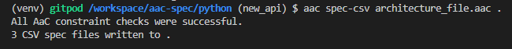
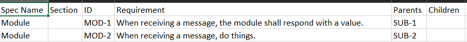
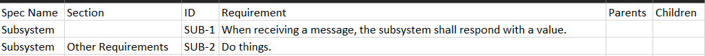
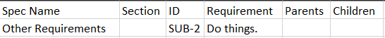

# Specifications Plugin

The `Specifications` plugin traces `Requirement`s of provided `Specification`s.  It does this through the `spec-csv` command, which generates a .csv file for a `Specification` which tracks its `Requirement`s.

## Spec-Csv Command
```bash
aac spec-csv architecture-file.aac output_directory
```

### Arguments

#### Architecture File
The AaC file containing the `Specification`s and `Requirement`s definitions.

#### Output Directory
The directory in which the .csv file will be generated.

## Plugin Usage Example

An Architecture File, `architecture_file.aac`, contains the following definitions:
```{eval-rst}
.. literalinclude:: ../../../python/tests/specifications/test_specifications.py
    :language: yaml
    :lines: 76-131
```
If you would like to generate a CSV file tracking the requirement relationships in the current directory, you would execute the following command:
```bash
aac spec-csv architecture-file.aac .
```
Which would return this in the command line:


It would also generate the following three CSV files:

`Module.csv`:


`Subsystem.csv`:


`Other_Requirements.csv`:


## Definition Type References

The two root types of definitions `spec-csv` accepts are `req` and `req_spec`

### req_spec Definitions

`req_spec`s are the `specification` definitions.  `spec-csv` will generate a CSV file for each `req_spec` provided by your architecture file, with a row for each given `requirement`

#### req_spec Example
```yaml
req_spec:
    name: specification_name
    description: Description of Specification
    sections:
        - Section_Specification_1
        - Section_Specification_2
    parent_specs:
        - Parent_Specification
    child_specs:
        - Child Specification
    requirements:
        - "REQ-1"
        - "REQ-2"
```

In the above example, all fields except for `name` are optional fields.  The `sections`, `parent_specs`, and `child_specs` fields all take the name of another `req_spec` definition, and the `requirements` field takes the `id` of a `req` definition.

### req Definition
`req`s are the `requirement`s of `specification`s.  In the generated CSV files, there will be a row generated for each listed `requirement`.

#### req Example
```yaml
req:
    name: requirement_name
    id: REQ-2
    shall: The Requirement Statement, which may reference a provided parameter with {req_parameter}
    parents:
        - "REQ-1"
    children:
        - "REQ-3"
    parameters:
        - name: req_parameter
          value: example_value
    verification_method: TEST
    attributes:
        - name: TADI
          value: test
```
In the above example, the `name`, `id`, and `shall` fields are required.  The others are optional.  The `parents` and  `children` fields take the `id`s of other `req` definitions.  The `verification_method` field is an enum that takes one of the following options: `ANALYSIS`, `DEMONSTRATION`, `INSPECTION`, or `TEST`.
